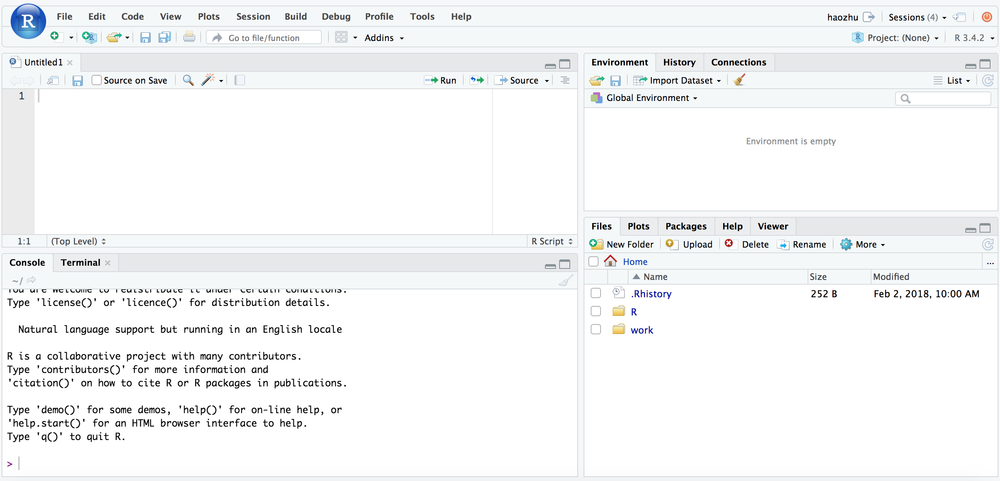

<!--
If you have any comments, please put them in a pair of HTML commemt symbols,
like this paragraph.

-->

[< Back to Index](/)


This chapter provides an introduction of using R with RStudio. Unlike other tutorials, here, we will not only teach you the "basics" but also give you a deeper explanation of how R works. Some of the points we discuss here may seem a little abstract at first, but they will help you to better understand the contents of the following chapters.

# RStudio Interface



- Top-Left: **Text editor** 
- Bottom-Left: **R Console**, Terminal
- Top-Right: **Environment**, History, Database Connections
- Bottom-right: **File System**, Plots, **R Packages**, **Help**, Viewer

\* _Bolded items represent the most important panes. We will focus on these first_

More advanced users can customize the layout using "Tools -> Global Options -> Pane Layout". For this workshop, we will use the standard layout. 

For more details, check out the official RStudio IDE cheatsheet in your package. You can also download it using the following link.  

[Download RStudio IDE Cheatsheet](https://github.com/rstudio/cheatsheets/raw/master/rstudio-ide.pdf)

If you are using our RStudio Server at the Marcus Institute, you can check out the [server guide we provided](https://ifar-connect.hsl.harvard.edu/using_rstudio_server).

#### Text editor & R Console
The **R Console** is used to **execute** R Commands. In most cases, we type R commands in the **Text editor** pane and send those commands to the console to execute. This allows us to save our code in a file. 

- You can hit `Control/Cmd + Enter` to send the current line of code or selected lines of code to the console to execute. 
- To run all, hit `Control/Cmd + A` to select all lines of code and then hit `Control/Cmd + Enter`.

# Getting Started with R
Let's get started with a few basic examples to lead us to the discussion of functions.

1. You can use R to do basic math calculations. 
```{r}
(12 + 33)^2 / 100
```

2. You can assign any value to a "variable" using `<-` or `=`. After you create the assignment, you can use this variable in all subsequent calculations. 
```{r}
x <- 33
(12 + x)^2 / 100
```

3. If you have a series of numbers, you can organize them into a `vector` using the function `c()`. Mathematical calculations using vectors follow mathematical rules.  
```{r}
x <- c(1, 2, 5, 9)
x + 1
```

4. You can see all your defined variables (including any defined functions) in the **Environment** tab in the top-right pane. You can also use the `ls()` function to list them out in your R console. If certain variables are not needed anymore, you can remove them from memory with the `rm()` function.
```{r}
a <- "Hello"
ls()
rm(a)
ls()
```

```{r}
# remove all objects
rm(list = ls())
```

So far, we have introduced you 3 functions: `c()`, `ls()` & `rm()`. In R, you call a function through its name. In the first example, the name of the function is `c`. You then insert the arguments of the function, in this case, `1, 2, 5, 9`, inside **parentheses**. For functions that do not require any arguments, you still need to use parenthese after the function name. This indicates that you want to **execute** the function instead of reviewing the source code of that function. 

### Help & Source Code
If you want to learn more about a function, typing `?` + function name will bring up the help page. For example, in this case, `?c`. You can also type the function name in the **Help** tab in the bottom-right pane. 

If you want to understand how the function works by reviewing its source code, typing the function name without the parentheses will print out the source code of the function in the console. Alternatively, you can hold `Control/Cmd` and click the function name in the Editor. A new tab will appear with the contents of the function. 

### Create your own function
It is also easy to write your own function in R. Self-defined functions help modualize your code and make it easier to read and maintain in the future. 

```{r}
plusOne <- function(your_number) {
  out <- your_number + 1
  return(out)
}
plusOne(1)
```

### R packages 📦
R packages are collections of user-contributed functions. The official R package repository is called CRAN. There are more than 13k packages on CRAN right now. CRAN uses a very strict code quality check on every submitted package. Generally speaking, we can consider the packages on CRAN to be "trusted". 


# Data Types
In this section, we use the term "data type" to indicate the type of data, regardless how the data is organized. "Data structure", which we will discuss below, refers to how the data are organized, regardless of their data types. For example, all the elements in set 1, 2, 3, 4, 5 are numeric (data type) and they are organized inside a vector (data structure). 

## Common Types
You can find most common data types in R. Here is a brief list:

- logical: `TRUE`/`FALSE` (or `T`/`F`)
- integer: `1L` 
- double (numeric): `1.23`
- character: `"1.23"`
...

You can check to see if a data item fits a particular data type by using the `is.***` function. 

```{r}
is.character(1.23)
is.character("1.23")
```

You can convert a data item from one type to another using the `as.***` function.
```{r}
x <- as.numeric("1.23")
class(x)
```

As you may have noticed, this list is ordered by the degree of generalizability. For your convenience, R will automatically handle some type conversions using this order. Types with a lower generalizability will be converted to the higher one when two or more data types are used together.

```{r}
T + 1.2           # T will be treated as 1 while F = 0

c("Hello", 123)   # 123 got converted to character string
```

## Date & Time
There are many other types of data in R. Here, we will review 2 useful data types: date and time.

```{r}
date_a <- as.Date("2019-01-01")
date_b <- as.Date("10/jan, 2019", "%d/%b, %Y")
c(date_a, date_b)
```

*Read more about date formats in R [here](https://www.statmethods.net/input/dates.html).*

You can also perform calculations using dates. Sometimes, it can be useful to convert the final result to numeric for further calculations. 
```{r}
date_a + 1
date_b - date_a
as.numeric(date_b - date_a)
```

In fact, you can even convert any date into a number. This number represents the number of days since "origin". By default, in most of modern programming languages, we use "1970-01-01" as the origin date (which is the approximate date when the computer was invented).
```{r}
as.numeric(date_a)
as.Date(-5000, origin = "1970-01-01")
```

# Data Structure
Compared to other popular programming languages, data structures in R have been simplified a lot. For most data analytical tasks, this is not a weakness. Instead, it's a strength of R and makes it much easier to use. For now, we will focus on the following 3 types: vector, list and data frame.

## Vector & Matrix (array)
### Vector (1D array)
A vector is a series of values **with the same data type**. For example, `c(1, 2, 4, 7)` is a vector and so is `c("a", "c", "s", "z")`. As we discussed before, if you combine two different data types in one vector, all the values will be converted to the data type that has the greatest generalizability (see the example above). 

You can access each element of a vector using the `[]` symbol. 
```{r}
x <- c(1, 2, 4, 7)
x[3] # Extracts the 3rd element of the vector "x", which is 4. 
```

You can check the length of a vector using the `length()` function. This function is one of the few function that will always work in R. We will talk about this more in the future.
```{r}
length(x)
```

You can use the length() function inside [] to extract the last element of the vector.
```{r}
x[length(x)]
```

If you want to generate a sequence of numbers from 1 to 5, you can use the `:` symbol. R also has pre-defined `letters` and `LETTERS` values so you can quickly extract certain English letters. 
```{r}
1:5
letters[1:5]
LETTERS[24:26]
```

Furthermore, you can assign names to a vector's elements and refer to each element by its name. Such vectors are called "named vectors".
```{r}
names(x) <- c("a", "b", "c", "d")
x["a"]
```

The same result can be achieved when you create the vector.
```{r}
x2 <- c("Apple" = 1, "Banana" = 2, "Pear" = 3)
x2
```

### Matrix & Array (2D/3+D array) (optional)
Mathematically, a vector is just a 1-dimensional array with a customized length of *N* (1 x *N*). We can extend this concept to a *m x n* matrix or a *a1 x a2 x a3 x ... x aN* multi-dimensional array. We have native support for these mathematical concepts in R. 

**Note that although matrices & arrays are quite useful for certain mathematical calculations, they are NOT the most common way we deal with data in R. The major restriction of a matrix/array is that, similar to a vector, these formats require that all the values inside share the same data type. This does not allow for many real-life data examples where some columns are numbers while others are character strings. For this reason, it is more comment to use `data.frame` or `tibble`, which we will talk about later, to store the data in R. **

The `matrix` function allows you to arrange a vector of values (not limited to numbers) into a matrix as long as you provide the desired number of rows or columns via `nrow` or `ncol`.
```{r}
m1 <- matrix(1:12, nrow = 2)
m1
```

Note that by default, the values are arranged by column. You can change this setting by turnning on the `byrow` option.
```{r}
matrix(1:12, nrow = 2, byrow = T)
```

Similar to vectors, you can refer to specific elements of the matrix using the `[]` locator.
```{r}
m1[2, 3] # 2nd row, 3rd column
```

Matrix calculation is also possible, following mathematical rules. To learn more about matrix operations, check out this page: https://www.statmethods.net/advstats/matrix.html. 
```{r}
# a 2 x 6 matrix multiplied by a 6 x 2 matrix, results in a 2 x 2 matrix
matrix(1:12, nrow = 2) %*% matrix(1:12, nrow = 6)
```

For 3D arrays, things are quite similar. However, here you must provide the size for each dimension. For both matrices and arrays, you can check the dimension using the `dim()` command. 
```{r}
ar <- array(1:24, dim = c(2, 3, 4))
dim(ar)
```

## List
A list is also a series of values but unlike a vector, it does **NOT** have any requirements for its elements. You can combine numbers, characters, dates, functions(!) and even another list together. Similar to a vector, you can also give names to each element when you create the list.

```{r}
lst <- list(
  "item1" = 1:5, 
  "item2" = "Hello world",
  "item3" = sum, # Note that this item is the name of a function. 
  # Since we did not include the parentheses, this function is not executed
  "item4" = list(1, 2, 3)
)
length(lst)
```

You can refer to each element of the list using the `[[ ]]` symbol. 
```{r}
lst[[3]](lst[[1]]) # equivalent to sum(1:5)
```

You can also call each element using the element names. Note here we are using the dollar sign (`$`) to call the element. We will discuss this in detail in the next section. 
```{r}
lst$item3(lst$item1)
```

Since a list can contain everything, it is the most useful, but also very messy, tool in R to hold your data. Later we will discuss the use of `base::lapply()` and `purrr::map()` to manipulate each element of a list. Below is an example of `lapply()`. We will talk about `purrr::map()` later as it's part of the beloved `tidyverse`.

```{r}
x <- list(
  1:5,
  11:15,
  21:25
)
lapply(x, sum)
```

In the example above, `lapply` applied the function `sum` to every element of a list of 3 vector and return the results as a list of 3 numbers.

## Data Frame & tibble
Most data that we analyze in our day-to-day work are organized using "columns" to represent the same type of data. For example, a data file might include a column with the market price for different items and a separate column containing the interview comments from different participants. As a result, the term "data frame" was created in the language S, which was the language preceeding R, and was re-implemented in R and Python recently through `pandas`. You can find the definition of "data frame" in the help page of `?data.frame` in R, which says:

> A data frame is a list of variables of the same number of rows with unique row names.

This definition reveals an important characteristic of a data frame: behind the scenes, **a data frame is a list of vectors which have the same length**. The *list* "frame" gives it the ability to hold different types of data. The *vector* element makes sure every "row" of the same column belongs to the same data type so you can confidently apply functions to them. Lastly, this design makes it easy to create statistical formulas and use graphical grammars in R. 

This design creates some unique characteristics of data analysis in R. First, **column-based calculations are much faster than row-based calculations**. We can think of the design of the data frame as an apple tree. Column-based calculations are like picking all of the apples from one branch while row-base calculations are like picking the 2nd apple from every branch. It is clear that the later method will be slower because you need to go to every branch and find the nth apple. Therefore, using a `for loop` to manipulate each row will be much slower than manipulating the columns directly. 

Now let's look at how a data frame actually works in R. To create a data frame, simply use the `data.frame` function. Here, we are creating a data frame with 2 columns (column1 & column2) and 3 rows. After you assign the data frame to the variable name `df`, you can refer to the `column1` column using `df$column1`. If you are using RStudio, you will see auto-complete hints when you type `$`.

```{r}
df <- data.frame(
  column1 = 1:3,
  column2 = c("Apple", "Pen", "Pineapple")
)
df$column1
```

Similar with vector and matrix, you can also refer to specific locations of the data frame using the `[ ]` locator.
```{r}
df[1, 2] # 1st row, 2nd column

df[1, ] # Entire 1st row

df[-1,] # All rows, excluding the 1st row

df[, 2] # Entire 2nd column
```

A `data.frame` has one notable drawback: if a column is a character data type, the data frame will convert this character string to factor. A factor is a special data type used for categorical variables. Together with the popularity of tidyverse, the format `tibble` is now preferred over the traditional `data.frame`. In addition, the structure of `tibble` is more advanced - we can have a column of tibbles in a tibble column. We will discuss these in details in the next chapters. 

`tibble` is available in the popular `tidyverse` package. You can start to use `tibble` after you load `tidyverse` package. 

```{r, message = F}
library(tidyverse)
tibble(
  A = c(2, 3, 5),
  B = c("a", "q", "z")
)
```

You can also define a tibble horrizonally via `tribble`. 
```{r}
tribble(
  ~A, ~B, # column names
  2, "a",
  3, "q",
  5, "z"
)
```

# Control Statements
## Conditional Logics
### Logical operators
Common logical operators in R include: == (equal to), != (not equal to), <, >, <= (less than or equal to), >= (greater than or equal to), %in% (within), ! (NOT).

### if Statement
This is the syntax for the 'if' statement in R:
```{r, eval = F}
if (condition) {
  do something
}

# or

if (condition) {
  do something
} else {
  do something else
}
```

Note that the length of the logical condition must be 1. In fact, a very common mistake is trying to use the `if` statement on a vector. The example below will trigger a warning.

```{r}
x <- 1:5

if (x == 2) {
  print("Hi")
}

# if we check the results of x == 2, we will get a logical vector of 5, which 
# can't be handled by regular if statement.
x == 2
```

### `ifelse` function
For this type of vector, consider using the function `ifelse` instead. Unlike `if`, `ifelse` works when the length of conditions is larger than 1. We will talk about this in detail in the future. 

```{r}
ifelse(x != 3, "A", "B")
```

Clearly, there are some fundemental differences between `if () {} else {}` and the `ifelse()` function. The former is designed mostly for conditional "actions" while the later is mostly used for conditional values for a vector. 

## for loops
Loops are also important concepts in programming. A loop allows you run an action repeatly with a dynamic (changing) parameter. The syntax in R for a `for` loop is shown below. Here, we define each element of the vector, one by one. 
```{r}
x <- c()
for (i in 1:5) {
  x[i] <- letters[i]
}
x
```

`for` loops provide a very flexible way of executing repeated tasks. They are particularly useful in complicated situations. 

#### Extended Reading (Read this when you already have some backgrounds in R)
There is a common misunderstanding that using a `for` loop in R is quite slow. Some users even believe that you should never use `for` loop in R. In fact, this impression is incorrect. First, as we discussed above, if you write a `for` loop looping across rows in a data frame/tibble, we know that the code will be quite slow due to the design of the data frame. Second, due to the internal mechanisms of R, the performance of a `for` loop can be heavily impacted by the efficiency of your code. The `for` loop code will have excellent performance as long as you do not create unnecessary memory references. You can find a comparison in the examples below. The details of these are discussed in Hadley's [Advanced R](https://adv-r.hadley.nz/index.html), which is a great resource for advanced knowledge in R programming. 

```{r}
# Bad practice
# This practice creates a new memory reference in every iteration and 
# assigns the new refernce id to the for_loop_bad variable. The 
# performance will get slower as the number of iterations increases. 
system.time({
  for_loop_bad <- c()
  for (i in 1:50000) {
    for_loop_bad <- c(for_loop_bad, i)
  }
})

# Good practice
# This practice modifies elements of the same object 50000 times. 
# The performance is almost linear.
system.time({
  for_loop_bad <- c()
  for (i in 1:50000) {
    for_loop_bad[i] <- i
  }
})
```

In the end, although performance time and code efficiency is important, most datasets that we encounter are not large enough to notice poor performance. If you are just beginning to learn R, I recommend that you focus on the contents of Chapters 2 & 3, before taking a deeper dive into the mechanisms of how R works. 

# Summary
- Basics
  - RStudio is an IDE while R is the actual software
  - Enter code in editor and `Control/Cmd + Enter` to execute code in console
  - `<-` is the assignment symbol in R
  - Enter `?functionName` to find help.
  - Functions handle most of the operations in R. 
  - Use `functionName(...)` to execute a function.
  - Use `functionName <- function( arguments ) { Action }` to define a function. 
  - R package is a collection of r functions written by other people. 
- Data Type
  - Logical: `T`/`F`
  - Integer: `1L`
  - Double: `1.23`
  - Character: `"1.23"`
  - Date, Time
- Data Structure
  - Vector & Matrix
  - List
  - Data.frame & Tibble
- Control Statements
  - `if`: `if (Condition) { Action 1 } else { Action 2 }`
  - `for`: `for (i in values) { Actions}`
  
# [< Back to Index](/)