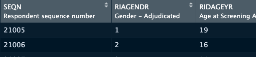

[< Back to Index](/)

In this chapter, we will go through the steps of reading data into R from different formats. Thanks to the fast growing R user community, R has access to most of the common data formats today. For static files, we usually choose tools from `readr`, `haven` and `readxl`. For databases accessible through web API, it is recommended to use `httr`. R also have access to most popular database plateforms through the `odbc` package and the corresponding database drivers. 

# Static Data Files

## readr: Flat text-based Data files
Flat files include formats such as `.csv`, `.tsv` `.txt` or sometimes even unrecognizable. The general rule of thumb to identify these files is that if you can open up the file using a text editor, that file belongs to this category. Although base R has its built-in function such as `read.csv`, `read.tsv` to do some of these tasks, it is recommended to use the `readr` package, which is already included in the `tidyverse` bundle to read in those data. The difference between the `readr` package and those base R function is that functions in `readr` can usually handle column types better. 

```{r}
library(tidyverse) # you can also do library(readr) to load 
                   # this specific package
```

```{r, eval=FALSE}
# Not evaluating
read_csv("data.csv")
read_tsv("data.tsv")
read_file("data.txt") # read file as one string
read_lines("data.txt") # read file as a vector of all lines
```

Here you can use either relative path or absolute path to the data files you have. If your data is stored somewhere online, you can also put the link here directly. 

```{r}
dt <- read_csv("https://raw.githubusercontent.com/rfordatascience/tidytuesday/master/data/2019/2019-03-05/jobs_gender.csv")
dim(dt)
```

`readr` also comes with functionalities to export data from R to files. 

```{r}
dt <- tibble::tibble(
  a = 1:4,
  b = letters[1:4]
)
write_csv(dt, "dt.csv")
write_tsv(dt, "dt.tsv")
```

## `haven`: SAS, Stata and SPSS files
Package `haven` provides support to dataset exported by SAS, stata & SPSS. It supports reading from the following formats:

**SAS**: `read_sas()` reads `.sas7bdat`, `.sas7bcat`; `read_xpt()` reads `.xpt` (SAS XPORT files ver 5 & 8).

**SPSS**: `read_sav()` reads `.sav`; `read_por` reads `.por`.

**Stata**: `read_dta` reads `.dta` (up to version 15).

It also supports writing from the following formats:

**SAS**: `write_xpt()` for `.xpt` files (FDA submission); `write_sas()` exists but may not always work as it's still work in progress.

**SPSS**: `write_sav()` for `.sav`

**Stata**: `write_dta()` for `.dta`

Here is an example of reading a `.sas7bdat` file from the US CDC website. 
```{r}
dm_sas <- haven::read_sas("https://www.cdc.gov/nchs/tutorials/dietary/Downloads/demoadv.sas7bdat")
dim(dm_sas)
```

```{r}
rmarkdown::paged_table(head(dm_sas))
```

You may wonder where the column labels are. Indeed, the column labels are read in. You are able to see them in the rendered data preview in RStudio. 



These labels are stored as an "attribute" for **each column**. Attribute is a form of data attached to an object, which can be in any type. You can either use `attributes(x)` to access all attributes of an object or use `attr(x, "attribute_name")` to access specific attribute. 

```{r}
attr(dm_sas$RIAGENDR, "label") # Or you can try attributes(dm_sas$SEQN)
```

In order to access labels for all columns, you can try to use the `purrr` package. We will talk about the details of using `purrr` in R in chapter 3 but here is a galance. If you chose to load `tidyverse` earlier instead of just `readr`, you don't need to load `purrr` again becuase it's already included in `tidyverse.

```{r}
map_chr(dm_sas, attr, "label")[1:5]
# lapply works in the same way lapply(dm_sas, attr, "label")
```

## `readxl`: Excel Spreadsheet xls & xlsx
`readxl` provides a very convenient way of reading excel spreadsheet. The usage is similar with `readr` and `haven`. The only difference is that many spreadsheets have multiple sheets of data. By default, the `read_excel` function in `readxl` will read the 1st sheet but you let the function know which sheet to read from. 

```{r, eval=FALSE}
# Not evaluating
readxl::read_excel("tests.xls", sheet = 1)
```

# Web API
Other than static data files, another important source of data nowadays is Web API. For those who are not familiar with this term, you can imagine a web API as a librarian - if you need anything, you send out a request with specifications. The librarian will look for the item and return it to you. For those popular API services, you can usually find a specialized R package to faciliate that API. Otherwise, you could try to use the `httr` package as a more general approach. In this chapter, we will use `REDCap`, which is a data-collection tool widely used in clinical research as an example and demonstrate how to read data using either the more specific `REDCapR` package or the more general `httr`. 

## `REDCapR`
`REDCapR` is a well-maintained R Package to facilitate data downloading from REDCap. To get started, you will need these two things: 1. the web address where to read the data from; 2. an authentication token that ensures it is you who are using this API. Whenever you are given an token, you should pay extra attention to the security of this combination and not share the token with anyone else. In this example below, we created a demo project hosted at our redcap server with fake data. Here we are using the `redcap_read_oneshot()` function. The returned result is a named list. The real "data" that you are expecting is stored in the data item. 

```{r}
library(REDCapR)

redcapr_dt <- REDCapR::redcap_read_oneshot(
  redcap_uri = "https://ifar-edc.hsl.harvard.edu/redcap/api/",
  token = "B6972E991CE5AC210D2D59070B1FF3DE"
)
names(redcapr_dt)
```

```{r}
dt <- redcapr_dt$data
rmarkdown::paged_table(head(dt))
```


It is also possible to add new data or update existing data to REDCap through the API. Here is an exmaple. We created a new data frame called `new_dt` with a new value `phone_1 = "2019-04-01"`. You can send this data back using the `redcap_write_oneshot()` function. 

```{r}
new_dt <- tibble(
  record_id = 3, redcap_event_name = "phone_arm_1",
  phone_1 = "2019-04-01"
)
REDCapR::redcap_write_oneshot(
  new_dt, 
  "https://ifar-edc.hsl.harvard.edu/redcap/api/",
  "B6972E991CE5AC210D2D59070B1FF3DE"
)
```

## `httr`
It is also possible to read from REDCap using the `httr` package. This method is more general and is what you should do when a designated R API package like `REDCapR` is not available or not well-maintained.  

```{r}
library(httr)

redcap_request <- POST(
  url = "https://ifar-edc.hsl.harvard.edu/redcap/api/",
  body = list(
    token = "B6972E991CE5AC210D2D59070B1FF3DE",
    content = "record", 
    format = "csv", 
    rawOrLabel = "raw"
  )
)
```

You will be able to find the documentations of all these variables on the official documentation site. Since different APIs are implemented by different groups and people, they vary a lot in terms of the names. That's why except the URL, nothing is really set-in-stone here. In most cases, as long as you read and follow the documentation, you should be able to get it work. 

**Example API documentation from REDCap**

<iframe src="redcap_doc.html" height="400px" width="100%"></iframe>

# Database
There are several different types of databases, MySQL, SQL server, PostgreSQL, etc. In the past, R used to have a separate package for each major database platform. Today, we tend to encourage you to use the `odbc` (with specific drivers installed) + `DBI` to do the work because `odbc` fills the gap among different databases and provides a unified and consistant interface to all plateforms. 

The best resource to learn more about databases in R is [RStudio's Database page](https://db.rstudio.com/).

Here is an example of setting up an connection to a running MySQL database. 
```{r, eval = FALSE}
# Not evaluating
library(DBI)
con <- dbConnect(odbc::odbc(), 
                 Driver    = "MySQL",
                 Server    = "your.SQL.server.address",
                 Database  = "DB Name",
                 Port      = 9999,
                 UID       = "user ID",
                 PWD       = "password")
```

Other than connecting to a remote database, for beginners, you can setup a local database using your own machine and practice your skills there. To do that you will need `RSQLite` installed. In the example below, we started a connection to the blank in-memory database and tried to write the data we read from REDCap earlier `dt` into a table called `redcap_dt` in the database. 

```{r}
library(RSQLite)

con <- dbConnect(RSQLite::SQLite(), ":memory:")

dbListTables(con)

dbWriteTable(con, "redcap_dt", dt)

dbListTables(con)
```

Now let's try to read some data from the database. If you are familar with SQL, this code might look very familiar to you. Here we are using the `dbGetQuery` function which send a [SQL query](https://www.w3schools.com/sql/sql_select.asp) to the database and download the results. If you are not familar with SQL, I recommend you to **learn it someday in the future** because it will always be useful. An alternative plan is to go through next chapter of this book and learn the syntax of `dplyr`. There are a lot of similarities between `dplyr` and `SQL` and you can even use `dplyr` to query SQL directly. 

```{r}
record1_dt <- dbGetQuery(con, "SELECT * FROM redcap_dt where record_id = 1")

rmarkdown::paged_table(record1_dt)
```
In the end, after you finish dealing with the database, it's always a good idea to disconnect them. 

```{r}
dbDisconnect(con)
```

# Summary
- Reading Data from Static Files
  - `readr`: txt, csv, tsv...
  - `haven`: SAS, Stata, SPSS...
  - `readxl`: Excel xls, xlsx
- Reading Data from Web API
  - Platform specific packages such as `REDCapR`
    - Easier to use
  - `httr`
    - Need to read the API manual
    - More general
- Reading Data from SQL Databases
  - `odbc` provides standardized drivers for different database formats
  - `DBI` provides a syntax to communicate with database
    - `dbConnect`, `dbListTables`, `dbGetQuery`, `dbWriteTable` & `dbDisconnect`
    
# [< Back to Index](/)
