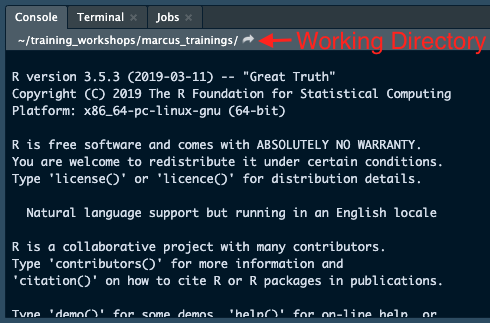
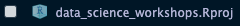

[< Back to Index](/)

In this chapter, we will learn how to read data into R from different sources files. Thanks to the fast growing R user community, there are tools available to read most of the common data formats that exist today. For static files, we will use tools from the `readr`, `haven` and `readxl` packages. For databases accessible through web API, it is recommended to use the package `httr`. R users can also access popular database platforms through the `odbc` package and the corresponding database drivers. 

# Static Data Files

## readr: Flat text-based Data files
Flat files include formats such as `.csv`, `.tsv` `.txt` or sometimes "unrecognizable" file types. Generally speaking, if you can open and view the file using a text editor, that file belongs to this category. Although base R has built-in functions to read in flat files (such as `read.csv`, `read.tsv`), it is recommended to use the `readr` package, (which is included in the `tidyverse` bundle) to read in these data. Functions in the `readr` package are better able to handle various column types compared to the base R functions. 

```{r}
library(tidyverse) # you can also do library(readr) to load this specific package
```

```{r, eval=FALSE}
# Not evaluating
read_csv("data.csv")
read_tsv("data.tsv")
read_file("data.txt") # read file as one string
read_lines("data.txt") # read file as a vector of all lines
```

Here you can use either a *relative path* or an *absolute path* to your data files. You can find a detailed discussion about these two terms and the concept of *working directory` in R in the [Extended Topics](#extended_topics) section below. 

If your data is stored online, you can also put the link here directly. 

```{r}
dt <- read_csv("https://raw.githubusercontent.com/rfordatascience/tidytuesday/master/data/2019/2019-03-05/jobs_gender.csv")
```

You can check the dimension of the `dt` object. The result tells you this dataset has 2088 rows and 12 columns. 
```{r}
dim(dt)
```

`readr` also allows you to export data from R to files. 

```{r}
dt <- tibble::tibble(
  a = 1:4,
  b = letters[1:4]
)
write_csv(dt, "dt.csv")
write_tsv(dt, "dt.tsv")
```

## `haven`: SAS, Stata and SPSS files
Package `haven` provides support to read in datasets that were created by SAS, stata & SPSS. Each function will accept the following formats:

**SAS**: `read_sas()` reads `.sas7bdat`, `.sas7bcat`; `read_xpt()` reads `.xpt` (SAS XPORT files ver 5 & 8).

**SPSS**: `read_sav()` reads `.sav`; `read_por` reads `.por`.

**Stata**: `read_dta` reads `.dta` (up to version 15).

It also supports writing datasets to the following formats:

**SAS**: `write_xpt()` for `.xpt` files (FDA submission); `write_sas()` exists but may not always work as it is still a work in progress.

**SPSS**: `write_sav()` for `.sav`

**Stata**: `write_dta()` for `.dta`

Here is an example of reading a `.sas7bdat` file from the US CDC website. 
```{r}
dm_sas <- haven::read_sas("https://www.cdc.gov/nchs/tutorials/dietary/Downloads/demoadv.sas7bdat")
dim(dm_sas)
```

Function `head` only prints out the first 6 rows of the dataset so you can take a glance of the table. Here we also want to print out the table nicely in this tutorial. Therefore, we use `rmarkdown::paged_table()` so the table we see below have pages. The `::` symbol means that we want to use the `paged_table` explicitly from the `rmarkdown` library. In your mind, you can read this as "'s" in English (similar with the `$` sign for data frame. 

```{r}
rmarkdown::paged_table(head(dm_sas))
```

You may wonder where to find the column labels. Indeed, the column labels are read in from the data file, and are different than the column names. You are able to see them in the rendered data preview in RStudio. 


These labels are stored as an "attribute" for **each column**. An attribute is a piece of data attached to an object, which can be any type. You can either use `attributes(x)` to access all attributes of an object or use `attr(x, "attribute_name")` to access specific attribute. 

```{r}
attr(dm_sas$RIAGENDR, "label") # Or you can try attributes(dm_sas$SEQN)
```

In order to access labels for all columns, you can use the map_chr() function in the `purrr` package. The `purrr` is included in the `tidyverse` package, so as long as you loaded the `tidyverse` package earlier (instead of just `readr`), you already have access to this package.

```{r}
map_chr(dm_sas, attr, "label")[1:5]
# lapply works in the same way lapply(dm_sas, attr, "label")
```

## `readxl`: Excel Spreadsheet xls & xlsx
`readxl` provides a convenient way to read in an excel spreadsheet using the function `read_excel`. By default, this function will read in the first worksheet, but the user can also specify which worksheet within the excel file you want to read.  

```{r, eval=FALSE}
# Not evaluating
readxl::read_excel("tests.xls", sheet = 1)
```

# Web API
Another important source of data is a Web API. If you are not familiar with Web APIs, you can compare it to a librarian. When you need to find something, you send out a request with specifications. The librarian will look for the item and return it to you - similiarly, the Web API will take your request and find the data you are looking for. For popular API services, there often exists a specialized R package to faciliate access to that API. Otherwise, you can try to use the `httr` package, which provides a general approach to API access. In this chapter, we will focus on `REDCap`, which is a data-collection tool widely used in clinical research. We will demonstrate how to read data using the specialized `REDCapR` package and using the more general `httr` package. 

## `REDCapR`
`REDCapR` is a well-maintained R Package to facilitate data downloading from REDCap. To get started, you will need two things: 1. the web address of your REDCap database; 2. an authentication token that ensures you have permission to access the API. Authentication tokens should be kept secure and not shared with anyone. In this example below, we created a demo project hosted on our REDCap server with fake data. Here we are using the `redcap_read_oneshot()` function. This function returns a named list. The actual "data" that you are expecting is stored in the data item within the list. 

```{r}
library(REDCapR)

redcapr_dt <- REDCapR::redcap_read_oneshot(
  redcap_uri = "https://ifar-edc.hsl.harvard.edu/redcap/api/",
  token = "B6972E991CE5AC210D2D59070B1FF3DE"
)
names(redcapr_dt)
```

```{r}
dt <- redcapr_dt$data
rmarkdown::paged_table(head(dt))
```


It is also possible to add new data to or update an existing data item in REDCap through the API. To demonstrate this, We created a new data frame called `new_dt` with a new value `phone_1 = "2019-04-01"`. You can send this data to the REDCap database using the `redcap_write_oneshot()` function. 

```{r}
new_dt <- tibble(
  record_id = 3, redcap_event_name = "phone_arm_1",
  phone_1 = "2019-04-01"
)
REDCapR::redcap_write_oneshot(
  new_dt, 
  "https://ifar-edc.hsl.harvard.edu/redcap/api/",
  "B6972E991CE5AC210D2D59070B1FF3DE"
)
```

## `httr`
It is also possible use the `httr` package to read data from REDCap. This general package is preferred when a designated R API package (like `REDCapR`) is not available or not well-maintained.  

```{r}
library(httr)

redcap_request <- POST(
  url = "https://ifar-edc.hsl.harvard.edu/redcap/api/",
  body = list(
    token = "B6972E991CE5AC210D2D59070B1FF3DE",
    content = "record", 
    format = "csv", 
    rawOrLabel = "raw"
  )
)
```

You can find the documentation for these functions on the official documentation site. Since different APIs are implemented by different groups and people, the syntax to access different APIs varies greatly. In most cases, as long as you read and follow the documentation, you should be able to get it work. 

**Example API documentation from REDCap**

<iframe src="redcap_doc.html" height="400px" width="100%"></iframe>

# Database
There are many different types of databases, including MySQL, SQL server, PostgreSQL, etc. In the past, R had a separate package for each major database platform. Today, we prefer to use `odbc` (with specific drivers installed) + `DBI` to access databases. The `odbc` package allows for a unified and consistant interface to all database platforms. 

The best resource to learn more about databases in R is [RStudio's Database page](https://db.rstudio.com/).

Here is an example of setting up an connection to a running MySQL database. 
```{r, eval = FALSE}
# Not evaluating
library(DBI)
con <- dbConnect(odbc::odbc(), 
                 Driver    = "MySQL",
                 Server    = "your.SQL.server.address",
                 Database  = "DB Name",
                 Port      = 9999,
                 UID       = "user ID",
                 PWD       = "password")
```

If you don't have a remote database that you want to access, you can setup a local database using your own machine and practice your skills there. To do that you will need to install the `RSQLite` package. In the example below, we started a connection to an empty, in-memory database and write the data we read from REDCap earlier `dt` into a table called `redcap_dt` in the database. 

```{r}
library(RSQLite)

con <- dbConnect(RSQLite::SQLite(), ":memory:")

dbListTables(con)

dbWriteTable(con, "redcap_dt", dt)

dbListTables(con)
```

We can also read data from the database. If you are familar with SQL, this code may be familiar to you. Here, we use the `dbGetQuery` function which send a [SQL query](https://www.w3schools.com/sql/sql_select.asp) to the database to download the results. If you are not familar with SQL, I recommend that you **learn it** because it will come in handy in many situations. Alternatively, in the next chapter we will discuss the syntax of `dplyr`. There are many similarities between `dplyr` and `SQL` - `dplyr` can even be used to query SQL directly. 

```{r}
record1_dt <- dbGetQuery(con, "SELECT * FROM redcap_dt where record_id = 1")

rmarkdown::paged_table(record1_dt)
```
Once you are finished working with any database, it is always good practice to end your connection to the database to ensure security. 

```{r}
dbDisconnect(con)
```

# Extended Topics
## Absolute Path, Relative Path and Working Directory
*Absolute path* is the full file path to a certain file/directory. It always allows the computer to find the file no matter where you started the program. Here are a few examples.

**On Windows**
- `C:/Users/you/Documents/my_files/file.txt`
- `~/Documents/my_files/file.txt`

**On Mac/Linux**
- `/home/you/Documents/work/file.txt`
- `~/work/file.txt`

On the other hand, *relative path* starts from the *working directory*. You can find the current *working directory* on top of your R console in your RStudio.


In most cases, we manage working directories via RStudio Project. Whenever you open up an `.Rproj` file, you will be brought to the folder that this `.Rproj` locates and use that folder as the working directory.



You can also obtain the path to the working directory within R via `getwd()` and change your working directory using`setwd()`

```{r}
getwd()
```

```{r, eval=F}
# Not evaluating
setwd("new_folder")
```

# Summary
- Reading Data from Static Files
  - `readr`: txt, csv, tsv...
  - `haven`: SAS, Stata, SPSS...
  - `readxl`: Excel xls, xlsx
- Reading Data from Web API
  - Platform specific packages such as `REDCapR`
    - Easier to use
  - `httr`
    - Need to read the API manual
    - More general
- Reading Data from SQL Databases
  - `odbc` provides standardized drivers for different database formats
  - `DBI` provides a syntax to communicate with database
    - `dbConnect`, `dbListTables`, `dbGetQuery`, `dbWriteTable` & `dbDisconnect`
    
# [< Back to Index](/)
