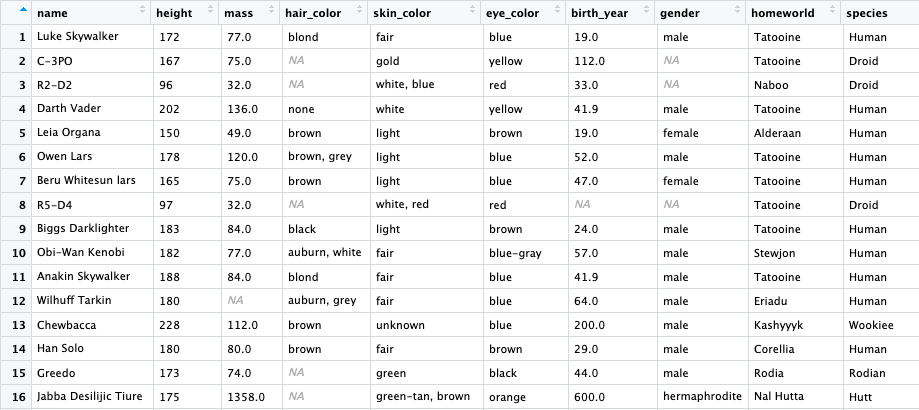

[< Back to Index](/)

`Tidyverse` is a collection of 8 awesome R packages, including:

- `dplyr`: Data manipulation (Chapter 3)
- `tidyr`: Data Long/Wide Transformation (Chapter 3)
- `purrr`: List-based manipulation (Chapter 3)
- `tibble`: Improved version of data.frame (Chapter 1)
- `readr`: Improved data reading methods (Chapter 2)
- `stringr`: String Operations using regular expression
- `forcats`: Categorical Analyses
- `ggplot2`: Data Visualizations with a set of grammar (Chapter 5)

In this chapter, since we will talk about data transformation, we will focus on `dplyr` and `tidyr`. We will also give a basic introduction to list-based analyses using `purrr` at the very end. For the rest of the packages, we will learn as we proceed forward. 

```{r, include = F}
library(tidyverse)
library(kableExtra)
```

# `dplyr` for data manipulation
Data manipulation covers most of our common tasks including adding or droping new columns or rows, generating summary stats and implementing conditional logics for columns. 

`dplyr` comes with a set of "data manipulation verbs" that can natually express nearly all data manipulation tasks in English. This design makes it very easy to learn and talk in this language and is one of the biggest reasons why people use R. In the following section, we will start by showing you a quick example (we will use this example multiple times in the future) followed by a detailed explanation on some of the most useful pieces of `dplyr`. We will have a few exercises in this middle because this section is highly practical. 

## Getting Started
In this example, we will use the `starwars` dataset, which is attached in `dplyr`. You need to load either `dplyr` or `tidyverse` to be able to access that. You can try to type `View(starwars)` in your R console to make sure you can access it. Here is a screenshot of how this data looks like. 



### Q1: What's the average height for all characters in Star Wars?
Obviously, we have a `mean()` function inside base R. The `na.rm = T` specifies how to deal with `NA`(missing) values: here we want to remove ("rm") them 
```{r}.
mean(starwars$height, na.rm = T)
```

We can also do it in the `dplyr` way. In `dplyr` we have a `summarize` function for generating any kinds of summary stats. Remember that **`summarize` always generates a new data frame**.
```{r}
starwars %>%
  summarize(mean_height = mean(height, na.rm = T))
```

Now it's also a good time to introduce the concept of piping in R. Mainly used by `tidyverse` packages but also adopted by a lot of others, piping or `%>%` is nothing but a structure that makes your code more readable. Technically, the `%>%` symbol does nothing but **send the result on the left to the next function as its first argument**. 

### Q2: What's the average height for all human characters in Star Wars?

In Base R, we can do
```{r}
mean(starwars[starwars$species == "Human", "height"], na.rm = T)
```

With `dplyr`, we just add a row of `filter`. The `filter` function selects out every row that fits the positive condition. 
```{r}
starwars %>%
  filter(species == "Human") %>%
  summarise(
    mean_height = mean(height, na.rm = T)
  )
```

### Q3: What's the mean and stand deviation of height for all human characters who have yellow eyes?
In Base R, we can do 
```{r}
mean(starwars[starwars$species == "Human" & starwars$eye_color == "yellow", ]$height, 
     na.rm = T)
sd(starwars[starwars$species == "Human" & starwars$eye_color == "yellow", ]$height, 
   na.rm = T)
```

In `dplyr`, we don't need to make too many changes when things get complicated. 

```{r}
starwars %>%
  filter(species == "Human" & eye_color == "blue") %>%
  summarise(
    mean_height = mean(height, na.rm = T),
    sd_height = sd(height, na.rm = T)
  )
```

### Q4: What's the mean and stand deviation of height in all species?
Base R, we can do it through `aggregate`, which is fine but the syntax is difficult to understand.
```{r}
aggregate(starwars$height, by = list(starwars$species), FUN = function(x) {
  c(mean = mean(x, na.rm = T), sd = sd(x, na.rm = T))
})
```

With `dplyr`, we will use the very powerful `group_by` function. 
```{r}
starwars %>%
  group_by(species) %>%
  summarise(
    mean_height = mean(height, na.rm = T),
    sd_height = sd(height, na.rm = T)
  )
```

### Quick Exercise

#### What are the average weights for human stratified by sex?

## `dplyr` Verbs
### `select`
`select` picks out columns by names or index.
```{r}
starwars %>%
  select(name:mass, gender, 9)
```

You can use the `-` negative sign to indicate that you don't want certain column(s).
```{r}
starwars %>%
  select(-(3:13))
```

There are also a few helper functions in `dplyr` that can help you quickly select out columns that fit your criteria. 

```{r}
starwars %>%
  select(contains("color"))
```

### `filter`
`filter` will select out rows that fit certain criterias. It take regular logical expressions in R and you can connect them with `&`(and) or `|`(or). Check [Chapter 1](/01_getting_started.html#control_statements) for details. 

```{r}
starwars %>%
  filter(eye_color == "red") %>%
  select(name, eye_color)
```

### `slice`
`slice` is a wrapper function of a special use case of `filter`: `filter(row_number() == something)`. It works in a similar way as `select`. It's mostly useful when you combine it with `group_by`. The example below will select out the first row in every eye_color. 

```{r}
starwars %>%
  group_by(eye_color) %>%
  slice(1) %>%
  select(1:2)
```

### `mutate`
People use `mutate` to add new columns or change existing columns. A typical use case is to combine `mutate` with `ifelse` to make conditional values. 
```{r}
starwars %>%
  mutate(
    human_gender = ifelse(species == "Human", gender, NA)
  ) %>%
  select(name, gender, human_gender, species) %>%
  slice(10:20)
```

### `summarize`
New users often mix up `mutate` and `summarize`. The main difference is that `mutate` works in the original data frame while `summarize` generates a new one. We showed quite a few examples previously so we will skip the example part here. 

### `group_by`
The only thing `group_by` does to a data frame is to put an "attribute" on it. The data frame itself still looks the same but when you send this data frame to other `dplyr` functions, those functions will know you want the actions to be done by groups. We can check the grouping information using `attributes()`.

```{r}
starwars %>%
  group_by(gender, species) %>%
  attributes()
```

### `join`
In many cases, we need to merge two data frames. R's native `merge` function works but `dplyr`'s `join` functions are just better. There are 4 join functions that are frequently used: `left_join`, `right_join`, `full_join` and `inner_join`. See [this page](https://stat545.com/bit001_dplyr-cheatsheet.html) for details. 


## Exercises
http://stat545.com/Classroom/notes/cm005-exercise.nb.html

# Tidy data
One of the greatest inventions of `tidyverse` is that it comes up with theory of a standardized way to organize values within a dataset. In Hadley's 2014 [tidy data](https://www.jstatsoft.org/article/view/v059i10/v59i10.pdf) paper, he summarized out the principles of a tidy data:

1. Each variable forms a column.
2. Each observation forms a row.
3. Each type of observational unit forms a table

Let's take a look at the following 5 sets of tables. Despite the totally different structures, these tables are representing the same information. Is there a way for us to describe the transformations among these formats?

```{r, echo=FALSE}
sable <- function(x, y) kable_styling(kable(x, caption = y), "condensed", full_width = F)

tbl1 <- sable(table1, "table1")
tbl2 <- sable(table2, "table2")
tbl3 <- sable(table3, "table3")
tbl4a <- sable(table4a, "table4a")
tbl4b <- sable(table4b, "table4b")
tbl5 <- sable(table5, "table5")

library(htmltools)
library(shiny)
fluidRow(
  column(4, HTML(tbl1)),
  column(4, HTML(tbl3)),
  column(4, HTML(tbl4a, tbl4b))
) 

fluidRow(
  column(6, HTML(tbl2)),
  column(6, HTML(tbl5))
) 
```


(You can find these 5 example tables in the `tidyr` package, which is included in `tidyverse`.)

In the tidy data paper, Hadley quoted Leo Tolstoy's words "Happy families are all alike; every unhappy family is unhappy in its own way." and commented

> Like families, tidy datasets are all alike but every messy dataset is messy in its own way.

The concepts of `tidy data` is a theory of good practice. In fact, if you are an experienced data analyst from other languages, you probably know that from some part of your heart already. This concept gives a name to what we often called "experience"  and a set of verb to decribe the action of transformation among these formats. In R, these actions are performed via three verbs from `tidyr` package, namely `gather`, `spread`, `separate` and `unite`. 

# tidyr
One metaphor of tidying up a dataset could be playing with sand. When you try to hold the sand with your hand, the sand `gather` together and become tall and narrow. When you smash the sand with your fist, it `spread` out and become thin and wide.

- gather: wide to tall
- spread: tall to wide
- separate: separate *ONE* multi-info column into *multiple* columns
- unite: unite *multiple* columns into *one* column

Let's create a messy data and use it as an example. This time we are trying to simulate an observational study with only 2 questions and 3 visits. The original maker of this dataset has never heard about tidy data so he organized the data in a very untidy way.

```{r}
library(tidyverse)
library(rmarkdown) # for paged_table
messy_dt <- tibble(
  id = c(1, 2, 3),
  test1_v1 = sample(100, 3),
  test1_v2 = sample(100, 3),
  test1_v3 = sample(100, 3),
  test2_v1 = sample(100, 3),
  test2_v2 = sample(100, 3),
  test2_v3 = sample(100, 3)
) 

messy_dt

```


`gather` collects data from all specified columns (if not specified, all columns) and turned them from columns to rows. Column names go to the "key" column while values go to the "value" column. 

```{r}
gather(messy_dt, key = "key", value = "value")
```

In this example, all the data from the original data frame gets arranged into these two columns, `key` & `value`. Both columns are newly generated. The `key` column includes all the previously column names while the `value` column includes all the numbers. However, this is not very helpful in this case because it treats the `id` column as a regular data column while it should have been left outside of the opperation. Therefore, we need to instruct `gather` to include the right variables in the transformation (or to exclude what should not be included). You can do that via putting column names after the `value` argument. You can also choose to put column names you don't want after a minus sign. Similar with numeric vectors (Chapter 1), `:` here means "to" in English. `test1_v1:test2_v3` means every column between `test1_v1` and `test2_v3`. 


```{r}
gather(messy_dt, "var", "value", test1_v1:test2_v3)
# equivalent to
# gather(messy_dt, "var", "value", -id)
# gather(messy_dt, "var, "value", test1_v1, test1_v2, test1_v3, test2_v1,
#        test2_v2, test2_v3)
```


# [< Back to Index](/)
