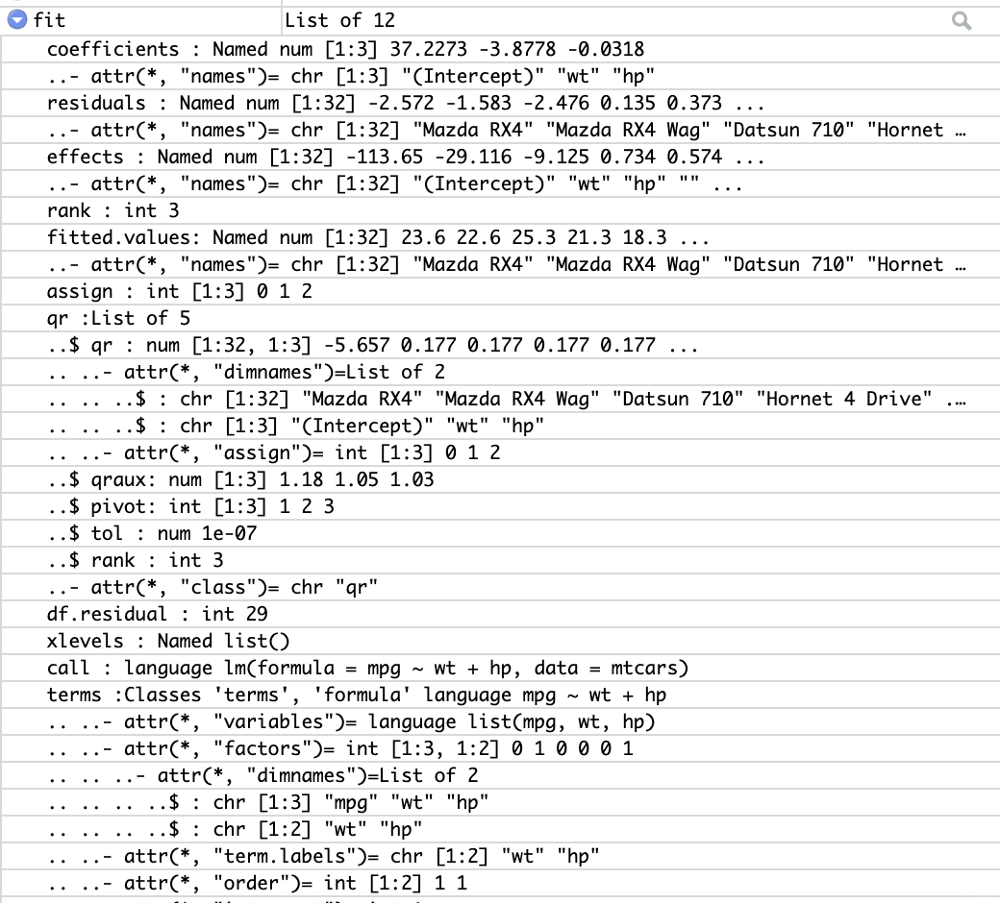

There are hundreds of statistical models that you can create in R. It is impossible (and also unnecessary) to cover them all in one chapter. Here, we are going to focus on the big picture. We will talk about the syntax for creating commonly used statistical models in R, how to easily summarize the results of the model and preparing your data for use in the models (imputation & scaling). 

# Getting Started
Let's start with a basic linear model. In R, most common statistical models can be accessed through a designated model function. In this case, we use `lm()` to construct a basic linear model. We need to provide the function with at least two pieces of information: the data and a formula. Formula in `lm()` and most of modeling functions in R takes the format of 

> y ~ x1 + x2 + ...

such that on the left side of `~` sits the outcome variable, while the predictors are on the right side. 

```{r}
fit <- lm(mpg ~ wt + hp, data = mtcars)
fit
```

Here, we are saving the results of 'lm()' to the object, "fit".  "fit" is a "model" object that contains all the information created by the 'lm()' function. Although the information printed out here may seem to be quite simple, the model itself is actually more complicated than you thought. Here is a screenshot of part of the actual model object. 



Since the models are usually complicated, in base R, we can use the function `summary` and `anova` to print out a summary and analysis of variance table of the results. If you want to use the model to do some prediction, you can use the `predict()` function to apply this model to new data.

```{r}
summary(fit)
anova(fit)
```

```{r}
new_cars <- data.frame(
  wt = c(1.256, 2.378),
  hp = c(100, 200)
)

predict(fit, new_cars)
```

In fact, these functions, `summary()`, `anova()` & `predict()`, are programmed in a way that they will react differently depending on the class of the input object. Therefore, function `summary()` will provide different insights to different types of models. This type of function is  called an `S3` function/method, which is part of R's simplified [object-oriented (OO)](https://en.wikipedia.org/wiki/Object-oriented_programming) programming style. 

For these types of functions, if you need to search for help, you need to search for things like `summary.lm`. That is the actual help file you should look at. The documentation of `summary` usually won't give you what you need. 

Let's get back to modeling. Base R `summary()` is great but the output generated is not in a table format. This worked well when analysts would transcribe the results by hand into a table, but it is not very conducive to using R Markdown and generaing automated reports.  Therefore, deeply influenced by the `tidyverse` package, the `broom` package includes tools to extract the information from models into a table. A lot of effort has been understaken in order to standardize all statistical models into the same format. 

```{r, message=F}
library(broom)

tidy(fit, conf.int = T)
```

`broom` also comes with 2 other verbs: `glance()` and `augment()`. The former provides a table summary of goodness of fit measures. The latter provides information on how individual data points contribute to the model.

```{r}
glance(fit)
```

```{r}
augment(fit)
```

# Model Construction Pipeline
## Running multiple models in one pipe
The `purrr` package in `tidyverse` is very useful when you want to run multiple models in one run. It was originally provided as a standardized tool to perform vectorized operations in R, which covers vectors and lists. 
```{r, message=F}
library(tidyverse)
mtcars_purrr <- mtcars %>%
  gather("key", "value", -mpg) %>%
  group_nest(key) %>%
  mutate(
    data = map(data, ~broom::tidy(lm(mpg ~ value, data = .x), conf.int = T))
  ) %>%
  unnest()

mtcars_purrr
```

## Imputation
When you have missing values in your data, imputation allows you to replace the missing values with estimates based on the available data, and reduce potential bias created by deleting missing observations. 

There are a number of different imputation strategies. Basic ones include mean/mode/median imputation. KNN can also be used to perform nearest neighbors imputation. 

```{r}
mtcars_mis <- mtcars
mtcars_mis$wt[sample(nrow(mtcars), 6)] <- NA
mtcars_mis$hp[sample(nrow(mtcars), 6)] <- NA

sum(is.na(mtcars_mis$wt))
```

For this kind of simple imputation, the [recipes](https://github.com/tidymodels/recipes) might be able to speed up the process a lot. The `recipes` package uses the `tidyverse` selector and helps you to build a "formula" of processing the data. Such formula includes common practices such as imputation and standardization. You don't have to use this package but it helps. 

```{r, message=F}
library(recipes)
recipe(mpg ~ wt + hp, data = mtcars_mis) %>%
  step_meanimpute(all_predictors()) %>%
  prep() %>%
  juice()
```

You can also perform multiple imputation (MI) via the [`mice`](https://github.com/stefvanbuuren/mice) package. 

```{r}
library(mice)

# you can specify the number of multiple imputations using m.
imputed_mtcars <- mice(mtcars_mis, m = 6, method = "pmm")

# and call out the 1st set of imputation in complete. 
mice::complete(imputed_mtcars, 1)
```

You can use the `purrr` skills you just learned to construct a separate model for each imputed dataset. 

```{r}
map(1:6, ~ mice::complete(imputed_mtcars, .x)) %>%
  map_df(~ broom::tidy(lm(mpg ~ wt + hp, data = .x)))
```

## Standardization
Sometimes we have predictors at totally different scales, it might be a good idea to standardize the values before sending them directly into the model. In this way, we can make sure different factors can be weighted on the same level when the model gets constructed. Again, the `recipes` package can be very helpful here. 

```{r}
scale_recipe <- recipe(mpg ~ wt + hp, data = mtcars) %>%
  step_center(all_predictors()) %>%
  step_scale(all_predictors()) %>%
  prep() 

juice(scale_recipe)
```

## Visualization
The most common techinique for visualizing models are forest plots, which are basically rotated point-and-error-bar plots. Here, we will use the data from the multiple univariate `lm()` models we created in the `purrr` example above.

```{r}
mtcars_purrr %>%
  # remove all the "intercept" items and keep only those slopes. 
  filter(term == "value") %>%
  ggplot(aes(x = key, y = estimate, ymin = conf.low, ymax = conf.high)) +
  geom_pointrange() +
  coord_flip()
```

# Common Statistical models
## GLM
### linear regression
```{r}
glm_fit <- glm(mpg ~ wt + hp, data = mtcars)
broom::tidy(glm_fit)
```

### Binomial logistic regression
Note that for logistical and multinomial models, you need to exponentiate the beta coefficients to get the odds ratios. If you are using base R's summaryfunction, you need to run `exp()` by yourself. If you are using `broom::tidy()`, you need to put `exponentiate = T` in your `tidy` function. A typical rule of thumb is that if you use `log` or `logit` in your link function (for example, here the `binomial(link = "logit")` is our link function), then you need to exponentiate your coefficient. 

```{r}
glm_bino <- glm(vs ~ wt + hp, data = mtcars, family = binomial(link = "logit"))

tidy(glm_bino, exponentiate = T)
```

### Poisson logistic regression
Running Poisson logistic regression is very similiar to binomial logistic regression. 

```{r}
poisson_dt <- data.frame(
  count = sample(100, 10),
  a = rnorm(10),
  b = rnorm(10)
)
poisson_glm <- glm(count ~ a + b, data = poisson_dt, family = poisson(link = "log"))

tidy(poisson_glm, exponentiate = T, conf.int = T)
```

## Mixed Effect
For all mixed effect models, we can use the `lme()` function from `library(nlme)`

```{r, message=F}
library(nlme)

exer <- read_csv("https://stats.idre.ucla.edu/stat/data/exer.csv")
exer <- exer %>%
  mutate(
    id = factor(id),
    diet = factor(diet),
    exertype = factor(exertype),
    time = factor(time)
  )

head(exer)

mixed_effect_fit <- lme(
  pulse ~ diet + exertype,
  random = ~ 1 | id / time,
  data = exer
)

summary(mixed_effect_fit)
```

## Survival Analysis
You can learn more about survival analysis in R from this blog post: https://rviews.rstudio.com/2017/09/25/survival-analysis-with-r/. In addition to what mentioned in this post, the [survminer](https://cran.r-project.org/web/packages/survminer/vignettes/Informative_Survival_Plots.html) package is another great tool to use for survival analysis. 


