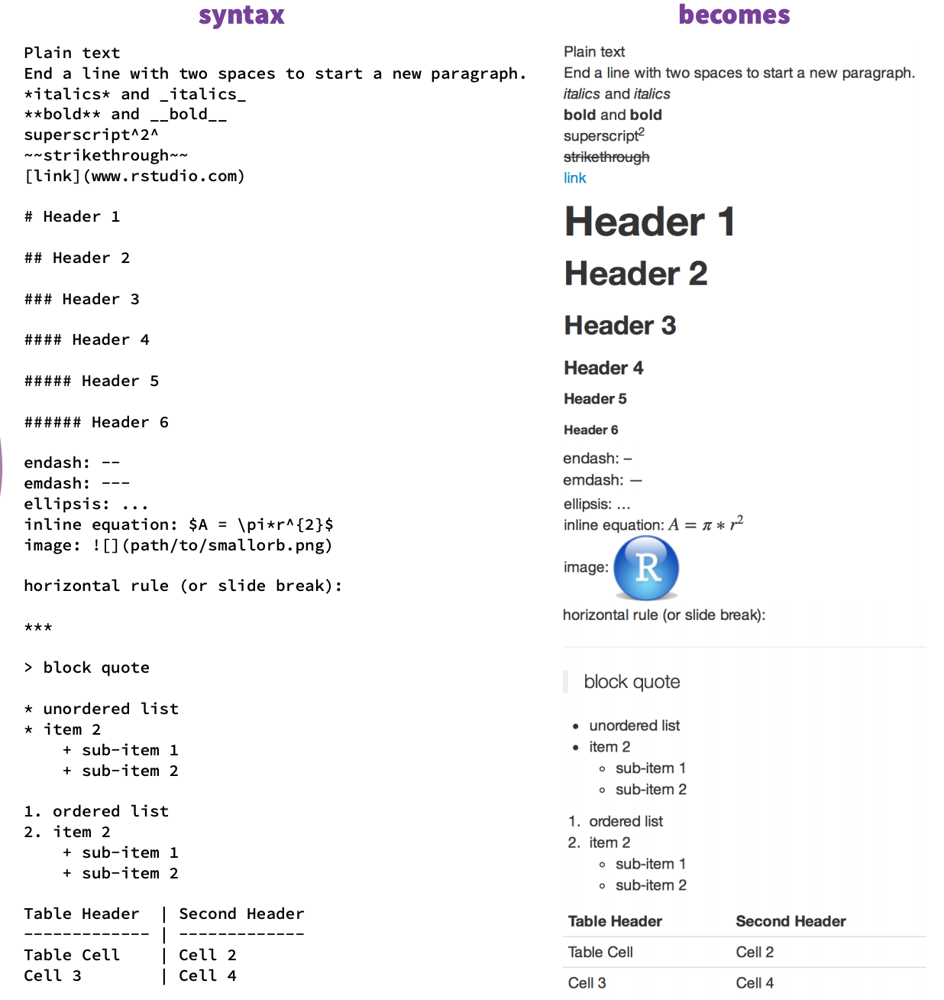

So far, we have gone over exploratory analyses using tidyverse (Chapter 3 & 4) and statistical modeling (Chapter 5). In the next two chapters, we will discuss how to present your analytical results to other people. We will talk about writing code-rich analytical reports using R Markdown and creating interactive apps for analytical purposes. 

In fact, as you might have realized that, this tutorial you are currently reading is written by R Markdown. If you go to your address bar and replace the final part ".html" with ".Rmd", you will be able to see the source ".Rmd" file. In this section, we are going to use this chapter as an example. Please open up the following two links in your browser. You are recommended to open up each on each side of your screen so you can compare the `.Rmd` source file and the results side by side. 

- [Source File](https://github.com/hebrewseniorlife/data_science_workshops/blob/master/06_rmarkdown.Rmd)
- [Result](https://keen-morse-23c558.netlify.com/06_rmarkdown.html)

# `YAML` Header
The first part of a `.Rmd` file is quoted inside a pair of `---`. This part is called the "yaml header". We use this part to define general settings of this document, such as document title, theme, etc.. In the example of this chapter, our `yaml` chapter looks like this one below. As you can see, you could list the document title, author, date and format here. The format part may look a little complicated in terms of the indentation but it can be as simple as `output: html_document`.

```{r, eval = F}
---
title: "R Markdown and Tables in Reports"
author: "Hao Zhu"
date: "2019-07-25 (updated `r Sys.Date()`)"
output: 
  html_document:
    theme: cosmo
    toc: true
    toc_float:
      collapsed: true
      smooth_scroll: true
      print: false
---
```

Here is a minimal `yaml` header. The only *required* piece is the `output` item, where you need at least say whether you want a webpage document, a PDF or a Word.

```{r, eval = F}
---
output: html_document
---
```

# Code Chunk
Below the `yaml` header is the "text" part, which consists of both codes and text. (R) codes are written between ```` ```{r} ```` and ```` ``` ````. If you are writing codes in RStudio, these coding area are usually highlighted. 

```{r}
# Please check the corresponding part in the .Rmd file
1 + 1
```

You can specify whether to display the code in `{r}`. Here we list out a few common options below:

- `echo`: T/F for displaying the code
- `eval`: T/F for evaluating the code and displaying the results
- `include`: A combination of `echo` and `eval`. 
- `message`: T/F for displaying the messages (For example the tidyverse starting message.)
- `fig.height` & `fig.weight`: Figure size in inches. 

In fact, you can just type a comma `,` right after r and you will see a list of options. 

Other than setting code chunk one by one, you can also setup a global option in the first chunk following the example below.

```{r, eval = F}
knitr::opts_knit$set(
  echo = T,
  eval = T
)
```

# Markdown Syntax

R Markdown uses the `Markdown` Syntax to represent meaningful structural information in plain text. Again, you can find a very helpful cheatsheet online.



# Tables in R Markdown
In a real "report", results are often organized into tables and figures. R has a pretty solid plotting system. After plots being generated, the task is basically done. However, the task of displaying tables is surprisingly complicated because we rely on the destinating format to generate the tables. For example, for webpages, we generate HTML table codes which are understood and processed by your browser. In the end you will see a table displayed on the page. For PDF, the mechanism is similar but we are trying to generate LaTeX codes this time. 

There are several ways to generate tables in R Markdown. One of the best solutions is the `kableExtra` package. It works for both `HTML` and `LaTeX` with a very similar syntax. You can find a simple example below. 

```{r}
library(kableExtra)

head(mtcars) %>%
  kable() %>%
  kable_styling("striped", full_width = F) %>%
  column_spec(1, background = "pink") %>%
  row_spec(2, bold = T) %>%
  add_header_above(c(" " = 1, "Group 1" = 5, "Group 2" = 6))
```

For more information, please refer to the package vignette:

- [kableExtra for HTML](https://haozhu233.github.io/kableExtra/awesome_table_in_html.html)
- [kableExtra for LaTeX](https://haozhu233.github.io/kableExtra/awesome_table_in_pdf.pdf)